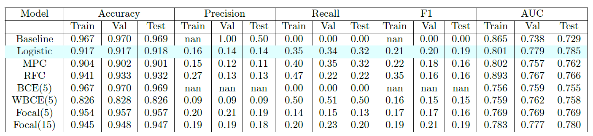

# Fine-Grained-Spoiler-Detection-from-Large-Scale-Review-Corpora

## Description:
In an age where media consumption is at an all-time high, the prevalence of book spoilers on review websites can significantly detract from the user experience. This project aims to develop an automated system for detecting spoiler sentences in large-scale text reviews, framing the task as a sentence-level binary classification problem.

Utilizing advanced machine learning techniques, we experiment with various models, including logistic regression, multi-layer perceptrons, random forests, and transfer learning approaches with large language models such as BERT and Hierarchical Attention Networks (HAN).

Through meticulous feature engineering and addressing class imbalance, we achieve notable improvements:

Focal loss is decreased by 32% for sentence-level classification using BERT and HAN models.
A significant 11% improvement over the baseline performance, demonstrating the effectiveness of our methodologies.
An 8% increase in Area Under Curve (AUC) scores with HANs compared to traditional logistic regression models.

By focusing on AUC as our primary evaluation metric, we navigate the challenges posed by class imbalance within our dataset, implementing various strategies, including class weightings, sampling techniques, and diverse loss functions. Our findings reveal that the logistic regression model outperforms others, achieving a test AUC of 0.785 while highlighting the importance of carefully managing class imbalance.

This project lays the groundwork for future enhancements, including the potential integration of user and book metadata, which could further enrich our predictive capabilities.


## Installation
To set up the Advanced Spoiler Detection on Large-Scale Text Reviews project, follow these steps:

### Prerequisites
Ensure you have Python (version 3.6 or later) installed on your system. You can check your Python version with:

```bash
python --version
```

### Required Packages
You can install the necessary packages using pip. Run the following commands in your terminal or command prompt:

```bash
!pip install sentence-transformers
!pip install transformers
!pip install imbalanced-learn
!pip install matplotlib
!pip install numpy
!pip install pandas
!pip install plotly
!pip install seaborn
!pip install torch
!pip install wordcloud
```

## Features
The Advanced Spoiler Detection on Large-Scale Text Reviews project includes several notable features that enhance its functionality and effectiveness in detecting spoiler sentences:

Sentence-Level Classification: The system is designed to automatically classify sentences as spoilers or non-spoilers, utilizing advanced machine learning techniques to ensure high accuracy.

Diverse Model Utilization: The project experiments with a variety of models, including:

Logistic Regression
Multi-layer Perceptrons (MPC)
Random Forest Classifiers (RFC)
Transfer Learning with BERT and Hierarchical Attention Networks (HAN)
Class Imbalance Mitigation: To address the class imbalance problem, various strategies are implemented, such as:

Underweighting the majority class
Undersampling and oversampling techniques
Custom class weightings to improve model performance
Advanced Loss Functions: The project evaluates multiple loss functions, including:

Binary Cross-Entropy (BCE)
Weighted Binary Cross-Entropy (WBCE)
Focal Loss, which demonstrates superior performance in classifying spoiler sentences
Performance Metrics: The effectiveness of the models is measured using:

Area Under Curve (AUC) as the primary evaluation metric
F1-score to assess the balance between precision and recall
Feature Engineering: The project employs sophisticated feature engineering techniques, including the use of dense embeddings from models like Sentence-BERT, to enhance the predictive power of the classification system.

Insights into Feature Importance: The analysis provides insights into feature importance, identifying the contributions of various features to model performance, particularly the significant role of the relative position of sentences.

Future Enhancements: The framework sets the stage for future improvements, including the potential integration of user and book metadata to further refine the classification process and boost predictive accuracy.

These features collectively contribute to the project’s goal of providing a robust and effective system for detecting spoilers in text reviews, enhancing the overall user experience in media consumption.

## Conclusion:
### Key Findings
Our analysis reveals several critical observations based on the results presented in the following table:



Baseline Model Performance: The baseline model predicts nearly all sentences as non-spoilers, resulting in an accuracy of approximately 97% but an F1-score of 0.00. This stark contrast underscores the challenges posed by class imbalance in the dataset.

Model Comparisons: While the performance of logistic regression, multi-layer perceptron (MPC), and random forest classifiers (RFC) is not optimal, these models achieve improved F1-scores on the test set without significant trade-offs in accuracy, maintaining above 90% accuracy. This highlights the effectiveness of our strategies to mitigate class imbalance, including underweighting the majority class, undersampling, and oversampling techniques.

Loss Function Insights: The BCE(5) model mirrors the baseline behavior, predicting almost all sentences as non-spoilers. In contrast, the WBCE(5) model tends to predict an excessive number of spoilers, leading to a notable drop in test accuracy, with a recall of only 0.5, indicating it correctly identifies just 50% of spoiler sentences. Among the evaluated loss functions, the Focal(5) loss function yields the highest F1 and AUC scores, suggesting it offers the best balance. However, training our transfer learning model with Focal loss for an additional 10 epochs only results in a modest 1% improvement in AUC.

Top-Performing Model: Our best-performing model, logistic regression, achieves a 19% improvement in F1-score and a 6% enhancement in AUC over the baseline model.

### Feature Importances
Quantifying the importance of features is challenging, as most originate from dense embeddings, which do not provide easily interpretable values. For our top-performing model (logistic regression), we estimate feature importance by calculating the ratio of each coefficient's magnitude to the total sum of all coefficients. This method suggests an average feature importance of approximately 0.259%. Notably, the relative position of the sentence (rel pos sentence) holds an importance of 1.830%, while the log length of the sentence (len sentence log) has an importance of 0.184%.

These results imply that the majority of the model's performance is driven by sentence-BERT embeddings, as anticipated. Encouragingly, the importance of the relative position of the sentence is about 7 times the average, suggesting it provides substantial value to the model. Conversely, the lower importance of the length of the sentence indicates it is less influential in the classification task.


## Contributing
We welcome contributions to the Advanced Spoiler Detection on Large-Scale Text Reviews project! If you have suggestions for improvements, features, or bug fixes, please feel free to reach out.

Team Members:  
Rohan Saraogi - rsaraogi@seas.upenn.edu  
Akash Sundar - aka2000@seas.upenn.edu  
Shikha Reddy - shikham@seas.upenn.edu  
Thank you for your interest in improving our project!


